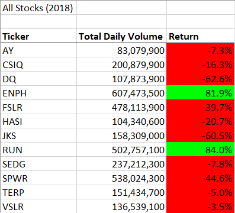
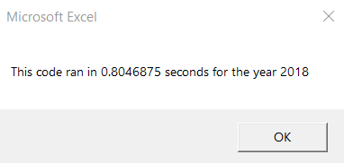
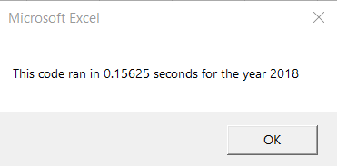

# Stock Analysis using VBA

# Overview of the project
The purpose of this project is to automate the calculations, using VBA Macros, of the Daily Volume and Yearly Return of stocks for the companies selected for this dataset. For educational puroses, the worksheet *All Stocks Analysis Pivot Table* provides the same calculations done with the macros, but performed with a Pivot Table and the *VLOOKUP* function.

# Results

## Stock results for 2017
The results obtained for 2017 indicate that it was a good year for the selected companies. *TERP* was the only company with a negative yearly return. *DQ* and *ENPH*, FSLR* and *SEDG* surpassed the 100% return.

## Performance for 2017
The nested loops macro took about 0.85 seconds to complete while the refactored version took about 0.15 seconds, that is a **567%** increase in performance.
Nested Loop macro                | Refactored macro
:-------------------------------:|:-------------------------------------:
 |  

## Stock results for 2018
The results obtained for 2017 indicate that it was a bad year for the selected companies with *JKS* and *DQ* having a return of under **-60%**. *ENPH* and *RUN* were the only company with a positive yearly return. Interestingly, most companies had a greater volume in 2018 than in 2017, which indicates that even though there were more transactions, this companies lost credibility.

## Performance for 2018
The nested loops macro took about 0.85 seconds to complete while the refactored version took about 0.15 seconds, that is a 567% increase in performance.
Nested Loop macro                | Refactored macro
 |  

