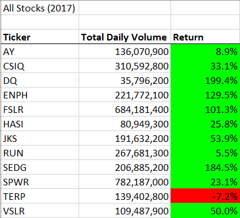
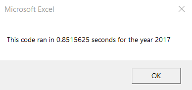
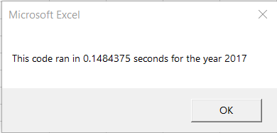

# Stock Analysis using VBA

# Overview of the project
The purpose of this project is to automate the calculations, using VBA Macros, of the Daily Volume and Yearly Return of stocks for the companies selected for this dataset.

# Results
## Stock results for 2017
The results obtained for 2017 indicate that it was a good year for the selected companies. *TERP* was the only company with a negative yearly return. *DQ* and *ENPH*, FSLR* and *SEDG* surpassed the 100% return.

## Performance for 2017
The nested loops macro took about 0.85 seconds to complete while the refactored version took about 0.15 seconds, that is a 567% increase in performance.
  

## Stock results for 2018
## Performance for 2018